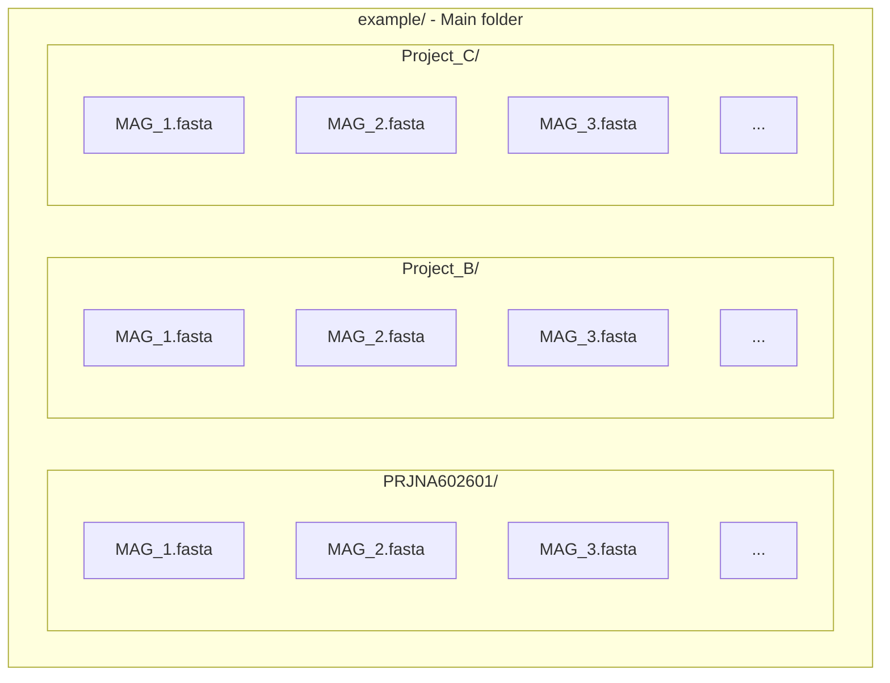

# Krill

An Integrated Bioprospecting Platform for Biosynthetic Gene Cluster Prioritization.

## :mag_right: SUMMARY
1. :scroll: ABOUT
2. :electric_plug: PRE-REQUISITES
3. :dvd: INSTALLATION
4. :woman_teacher: PREPARING YOUR FILES
5. :woman_technologist: USING

## :scroll: ABOUT

Krill is a tool designed to aid in the analysis of genomic data with a focus on biosynthetic gene clusters (BGCs).

<p align="justify">The package was developed with financial support from the Foundation for Research and Innovation Support of the State of Santa Catarina (FAPESC, process 2020TR1448) and the São Paulo Research Foundation (FAPESP, process 2019/27306-9), as well as the Brazilian National Institute of Science and Technology - INCT-Mar COI (CNPq, Process 400551/2014–4). We also wish to thank the Coordination for the Improvement of Higher Education (CAPES) for the scholarships provided to H.N. (88887.146746/2017–00). A.O.S.L. was further supported by CNPq (312363/2018–4). D.B.B.T. and P.B. also acknowledge funding from the Serrapilheira Institute (Serra-1709–19681 and associated fellowship ref. 3659).</p>

Package Features:
1. Data pre-processing for contigs extraction (updating); 
2. Extraction of biosynthetic gene clusters (BGCs); 
3. Annotation of resistance genes; 
4. Similarity analysis and annotation of biosynthetic families; 
5. Curation of prospected clusters. 

## :electric_plug: PRE-REQUISITES
1. Ubuntu 20.04
2. Python 3.X
3. R
4. Conda


## :dvd: INSTALLATION

<details><summary>INSTALLING KRILL</summary>
<p>


1. Create a conda environment for Krill

```
conda create -n Krill
```

2. Clone Krill github repository

Navigate to the folder where Krill will be downloaded

```
git clone https://github.com/HenriqueNiero/Krill.git
```

3. Install pre-requisite packages

python=3.9

Ubuntu/Linux Packages:  
hmmsearch  
gawk  
parallel=20260422  
r-base-core  

Conda Packages:
hmmer=3.1b2  
seqkit=2.13.0  

Python packages:  
pandas=2.3.1  
matplotlib=3.9.4  
cprint  
numpy=1.26.4  
biopython=1.78  
tqdm  
Xlsxwriter=3.2.9  
pyScss=1.4.0  


</p>
</details>


<details><summary>INSTALLING ANTISMASH</summary>
<p>

Installing AntiSMASH inside Krill environment

```
conda activate Krill
conda install -c conda-forge -c bioconda -c defaults antismash==6.1.1
```

Copy the record_processing.py file from Krill github repository and paste into the antismash folder inside Krill environment (substitute the existing one).  
/envs/Krill/lib/python3.9/site-packages/antismash/common/record_processing.py


</p>
</details>


<details><summary>INSTALLING ARTS via Conda</summary>

<p>
    
1. Download environment spec list file from this repository (arts_specs.txt)
    
2. Create a conda environment for ARTS using the spec list file
    
```
conda create -n "ARTS" --file /path/to/spec-file.txt
```
 
3. Download ARTS project into the conda environment using git
    
```
cd /path/to/ARTS/environment/
git clone https://bitbucket.org/ziemertlab/arts.git
```


4. Download additional reference models for ARTS

The reference metagenome folder is used in Krill

```
cd /envs/ARTS/arts/reference
wget https://arts.ziemertlab.com/static/zip_refsets/all_references.zip
```

Unzip all_references.zip file

Replace the "reference" folder in ARTS environment with the new one

The final folder structure must be /envs/ARTS/arts/reference/metagenome/


</p>
    
</details>


<details><summary>INSTALLING BIG-SCAPE via Conda</summary>

<p>
    
1. Create a conda environment and install BiG-SCAPE

```
conda create -n bigscape -c conda-forge -c bioconda bigscape
```

2. Download the Pfam-A.hmm.gz phmm database

    Follow [Installing and Running BiG-SCAPE](https://github.com/medema-group/BiG-SCAPE/wiki/01.-Installing-and-Running-BiG-SCAPE) from BiG-SCAPE repository

    Download the Pfam database inside Krill directory

    Unzip the file


</p>
    
</details>


## :woman_teacher: PREPARING YOUR FILES

Krill works in a single folder with fasta files or in a folder with different Projects MAGs (multiple folders). For this second option, it needs to have a [specific folder organization](example/) to start the analysis:

> :warning: DO NOT USE SPACES IN FOLDERS AND FILES NAMES, IT CAN CAUSE ERRORS.

<details><summary>FOLDERS AND FILES STRUCTURE</summary>
<p>
    
#### Flowchart Scheme


#### Printscreen Scheme
<p align="center">
    
</p>
</p>
</details>
    
## :woman_technologist: USING

Krill can be run with command line in a linux terminal

```
cd /path/to/folder/where/Krill/was/downloaded/
conda activate Krill
python3 Krill /home/user/path/to/folder/where/Krill/was/downloaded/example -noprep --bigscape --pfam-path /home/user/path/to/Pfam/database/Pfam-A.hmm
```


```
Krill [OPTIONS] PATH
```

```
usage: Krill [-h] [-noprep] [-t THREADS] [--citation] PATH

positional arguments:
  PATH                  Working path with fasta files

optional arguments:
  -h, --help            show this help message and exit
  -noprep, --do_not_prepare_fasta_files
                        Rename fasta files, its headers and store changes in a CSV file for control [DEFAULT: TRUE]
  --bigscape            Run Krill with BiG-SCAPE analysis
  --pfam-path           Path to BiG-SCAPE Pfam phmm database                      
  -t THREADS, --threads THREADS
                        Threads to use in analysis [DEFAULT: 16]
  --citation            Shows how to cite us

```

## Contributors 
<table>
    <tr>
        <td align="left" valign="top" width="14.28%"><a href="https://github.com/saulobritto"><br />Saulo Britto</a></td>
        <td align="left" valign="top" width="14.28%"><a href="https://github.com/ellenjkr"><br />Ellen Junker</a></td>
        <td align="left" valign="top" width="14.28%"><a href="https://github.com/machenka-code"><br />Maria Nascimento</a></td>
        <td align="left" valign="top" width="14.28%"><a href="https://github.com/HenriqueNiero"><br />Henrique Niero</a></td>
    </tr>
</table>
