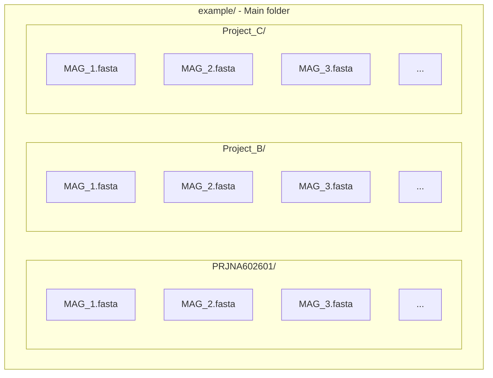

# Krill

An Integrated Bioprospecting Platform for Biosynthetic Gene Cluster Prioritization.

## :mag_right: SUMMARY
1. :scroll: ABOUT
2. :sunny: OVERVIEW
3. :electric_plug: PRE-REQUISITES
4. :dvd: INSTALLATION
5. :woman_teacher: PREPARING YOUR FILES
6. :woman_technologist: USING
7. :file_folder: OUTPUT


## :scroll: ABOUT

Krill is a computational platform designed to support the analysis and prioritization of biosynthetic gene clusters (BGCs) from genomic data.

Krill integrates BGC detection, resistance-gene annotation, biosynthetic gene-cluster similarity analysis, and BGC curation to support the identification of clusters of potential interest for downstream investigation.


<p align="justify">The package was developed with financial support from the Foundation for Research and Innovation Support of the State of Santa Catarina (FAPESC, process 2020TR1448) and the São Paulo Research Foundation (FAPESP, process 2019/27306-9), as well as the Brazilian National Institute of Science and Technology - INCT-Mar COI (CNPq, Process 400551/2014–4). We also wish to thank the Coordination for the Improvement of Higher Education (CAPES) for the scholarships provided to H.N. (88887.146746/2017–00). A.O.S.L. was further supported by CNPq (312363/2018–4). D.B.B.T. and P.B. also acknowledge funding from the Serrapilheira Institute (Serra-1709–19681 and associated fellowship ref. 3659).</p>

Key Features:
1. Data pre-processing for contigs extraction (updating); 
2. Extraction of biosynthetic gene clusters (BGCs); 
3. Annotation of resistance genes; 
4. Similarity analysis and annotation of biosynthetic families; 
5. Curation and prioritization of BGCs. 


## :sunny: OVERVIEW

Krill integrates multiple computational analyses into a single BGC prioritization workflow:

                  FASTA / MAGs
                       │
                       ▼
              FASTA preparation
                       │
                       ▼
                   antiSMASH
                       │
              ┌────────┴────────┐
              ▼                 ▼
          BGC detection       BGC annotation
              │
              ▼
             ARTS
              │
       ┌──────┼──────┐
       ▼      ▼      ▼
    Known   Core   Duplicate
    hits    genes    genes
       │      │      │
       └──────┼──────┘
              ▼
          BiG-SCAPE
              │
              ▼
       Krill integration
              │
              ▼
       GCF / similarity
              │
              ▼
       Prioritized BGCs

The main components of the workflow are:

antiSMASH — identification and annotation of biosynthetic gene clusters.
ARTS — analysis of resistance-associated genes, core genes, and duplicated genes.
BiG-SCAPE — BGC similarity analysis and gene-cluster family (GCF) assignment.
Krill — integration and organization of the results for BGC prioritization.


## :electric_plug: PRE-REQUISITES

Krill has been developed and tested in a Linux environment.

Operating system  
- Ubuntu 20.04 or compatible Linux distribution

Required software  
- Python 3.9  
- R  
- Conda  

Krill uses three Conda environments:  
- Krill  
- ARTS  
- bigscape  

The environments should be kept separate because ARTS, Krill, and BiG-SCAPE have different software dependencies.


## :dvd: INSTALLATION

<details><summary>INSTALLING KRILL</summary>
<p>

1. Create a conda environment for Krill

```
conda create -n Krill python=3.9
conda activate Krill
```

2. Clone Krill github repository

Navigate to the folder where Krill will be downloaded

```
git clone https://github.com/HenriqueNiero/Krill.git
```

3. Install pre-requisite packages

Ubuntu/Linux Packages:  
- hmmsearch  
- gawk  
- parallel=20260422  
- r-base-core  

Conda Packages:  
- hmmer=3.1b2  
- seqkit=2.13.0  

Python packages:  
- pandas=2.3.1  
- matplotlib=3.9.4  
- cprint  
- numpy=1.26.4  
- biopython=1.78  
- tqdm  
- Xlsxwriter=3.2.9  
- pyScss=1.4.0  


Verify the Krill environment
```
conda activate Krill
python --version
which python
```
Then
```
cd /path/to/Krill
python3 Krill -h
```


</p>
</details>


<details><summary>INSTALLING ANTISMASH</summary>
<p>

Installing AntiSMASH inside Krill environment

```
conda activate Krill
conda install -c conda-forge -c bioconda -c defaults antismash==6.1.1
```

Krill includes a modified record_processing.py.

Copy the version provided in the Krill repository to the antiSMASH installation and replace the existing file:

/envs/Krill/lib/python3.9/site-packages/antismash/common/record_processing.py

Verify AntiSMASH
```
conda activate Krill
antismash --version
which antismash
```

</p>
</details>


<details><summary>INSTALLING ARTS via Conda</summary>

<p>

Krill uses ARTS release 3.0b2.

1. Download ARTS environment specification file from the Krill repository (arts_specs.txt)
    
2. Create a conda environment for ARTS using the spec list file
    
```
conda create -n ARTS --file /path/to/spec-file.txt
```
 
3. Clone the ARTS repository into the ARTS environment:
    
```
cd /path/to/ARTS/environment/
git clone https://bitbucket.org/ziemertlab/arts.git
```


4. Install the ARTS reference datasets

Krill requires the ARTS reference datasets, including the metagenome
reference set.

Navigate to the ARTS reference directory:

```
cd /envs/ARTS/arts/reference
```

Download the reference dataset:

```
wget https://arts.ziemertlab.com/static/zip_refsets/all_references.zip
```

Unzip the downloaded file and replace the existing reference directory with the downloaded reference directory.

The expected structure is:  
ARTS/
└── arts/
    └── reference/
        └── metagenome/


Verify ARTS
```
conda activate ARTS
python --version
which python
```
Then
```
cd /path/to/ARTS
python artspipeline1.py --help
```


</p>
    
</details>


<details><summary>INSTALLING BIG-SCAPE via Conda</summary>

<p>

Krill uses BiG-SCAPE 2.0.3.

1. Create a conda environment and install BiG-SCAPE

```
conda create -n bigscape -c conda-forge -c bioconda bigscape
```

Activate it
```
conda activate bigscape
```

2. Install the Pfam database

Krill has been tested with Pfam release 38.2.

Follow [Installing and Running BiG-SCAPE](https://github.com/medema-group/BiG-SCAPE/wiki/01.-Installing-and-Running-BiG-SCAPE) from BiG-SCAPE repository

Download the Pfam database Pfam-A.hmm.gz

Place the Pfam database in an appropriate location accessible to Krill and decompress it

```
gunzip Pfam-A.hmm.gz
```


(Note: Depending on the BiG-SCAPE installation, the Pfam database may also need to be prepared with hmmpress.)


Verify BiG-SCAPE
```
conda activate bigscape
python --version
bigscape --help
```


</p>
    
</details>


## :woman_teacher: PREPARING YOUR FILES

Krill works in a single folder with fasta files or in a folder with different Projects MAGs (multiple folders). For this second option, it needs to have a [specific folder organization](example/) to start the analysis:

> :warning: DO NOT USE SPACES IN FOLDERS AND FILES NAMES, IT CAN CAUSE ERRORS.

<details><summary>FOLDERS AND FILES STRUCTURE</summary>
<p>
    
#### Flowchart Scheme


#### Printscreen Scheme
<p align="center">
    
</p>
</p>
</details>
    
## :woman_technologist: USING

Krill is run from a Linux terminal.

Activate the Krill environment:

```
conda activate Krill
```

Navigate to the Krill directory:

```
cd /path/to/Krill
```

Basic analysis

```
python3 Krill /path/to/input/folder
```

Run with BiG-SCAPE

```
python3 Krill /path/to/input/folder --bigscape --pfam-path /path/to/Pfam-A.hmm
```


Skip FASTA preparation

If the input FASTA files have already been prepared and their names and headers should be preserved:  
The -noprep option skips FASTA preparation and uses the input files and headers as provided.


```
python3 Krill /path/to/input/folder -noprep --bigscape --pfam-path /path/to/Pfam-A.hmm
```


Command-line options

```
Krill [OPTIONS] PATH
```

```
usage: Krill [-h] [-noprep] [-t THREADS] [--citation] PATH

positional arguments:
  PATH                  Working path with fasta files

optional arguments:
  -h, --help            show this help message and exit
  -noprep, --do_not_prepare_fasta_files
                        Skip FASTA preparation and use the input files names and headers as provided
  --bigscape            Run Krill with BiG-SCAPE analysis
  --pfam-path           Path to BiG-SCAPE Pfam phmm database                      
  -t THREADS, --threads THREADS
                        Threads to use in analysis [DEFAULT: 16]
  --citation            Shows how to cite us

```


## :file_folder: OUTPUT

Krill generates an output directory containing, among others:

- BGC cluster annotations
- ARTS resistance/core/duplicate gene results
- integrated BGC tables
- BiG-SCAPE GCF/network results
- prioritized BGC information
- intermediate files required for traceability


Krill generates an output directory containing intermediate and final results from the different stages of the analysis.

Depending on the analysis performed, the output includes:

- BGC cluster annotations
- ARTS resistance-gene results
- ARTS core-gene results
- ARTS duplicate-gene results
- Integrated BGC tables
- BiG-SCAPE GCF and network results
- Prioritized BGC information
- Intermediate files required for traceability

The intermediate files are retained to facilitate inspection of individual analysis steps and troubleshooting.


## Contributors 
<table>
    <tr>
        <td align="left" valign="top" width="14.28%"><a href="https://github.com/saulobritto"><br />Saulo Britto</a></td>
        <td align="left" valign="top" width="14.28%"><a href="https://github.com/ellenjkr"><br />Ellen Junker</a></td>
        <td align="left" valign="top" width="14.28%"><a href="https://github.com/machenka-code"><br />Maria Nascimento</a></td>
        <td align="left" valign="top" width="14.28%"><a href="https://github.com/HenriqueNiero"><br />Henrique Niero</a></td>
    </tr>
</table>
